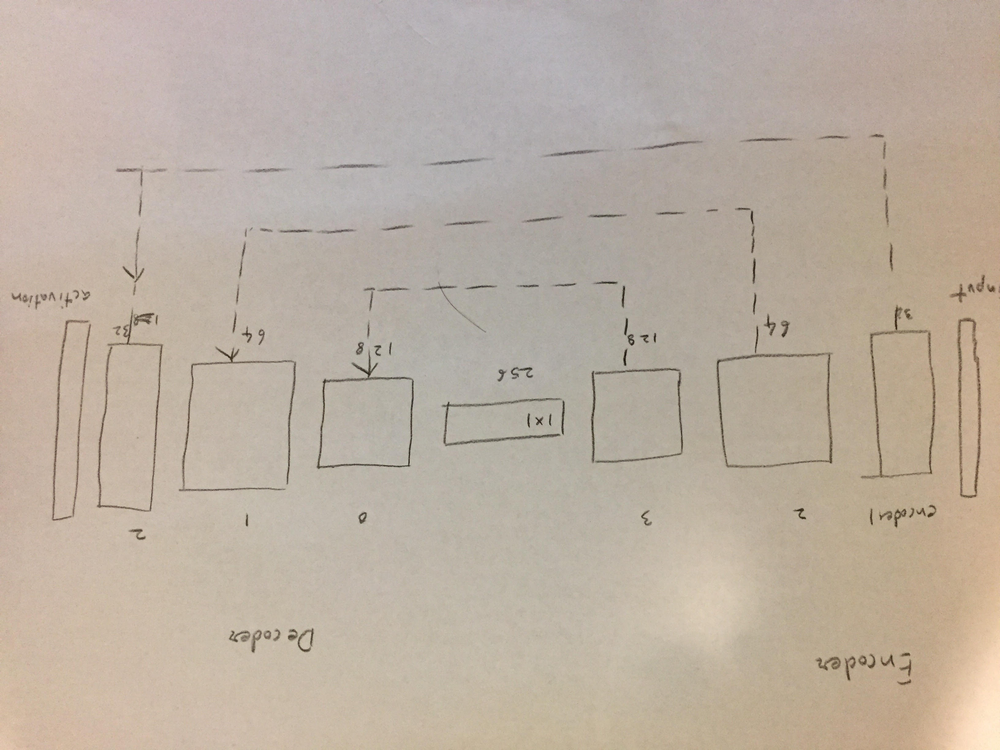

## Project: Follow Me
### Project report and execution
---

## Project report
The goal of this project is to implement a DNN what would take camera input from the drone and segment and identify the target and follow it.

The drone simulator is provided by Udacity and our goal is to train a DNN such that it's weights can be used to perform inference for target identification.


This project offers interesting challenges in terms of choosing the layers, and hyperparameters.


### Network Architecture
In this project we not only have to perform the task of target detection but also identifying the target in the 2D space inorder to follow the target and for this purpose we choose fully convolution network. 

Typical CNN consists of series of convolutiuon layers folowed by fully connected layer and an activation layer, however this architecture doen't preserve spatial information, however if we replace the fully connected layer with upsampling convolution the spatial information is preserved and hence can detect the target un 2D space and suits segmentation task.

Distinct features of fully convolution networks (FCN) are 
* `1 x 1 convolution layer`: `1x1` layer as used to control dimensionality in filter space. Imagine we feed in the tensor output of `(H, W, D)` to a `1 x 1` layer with `D1` filter, and if `D1 > D` the dimentionality increases thus preserving spatial information.
* `Upsampling layer`: Upsampling is done by series of layers which perform reverse covolution, here the forward and backward passes are swapped. This layer performs the scaling operation such that the output is same size as the imput image.
* `Skip connections`: The skip connections allow the network to use input from multiple resolution scales in decoding phase. During the decoding phase some information might be lost, having skip connections helps the network preseve the original resolution scale.




### Hyperparameter tuning
* learning rate = 0.001, higher learning rate didn't perform well where as dropping the learning rate while increasing number of epoch lead to better performance but with increased training time, and hence had to balance this with number of epochs & time taken to train.
* batch size = 64, batch size of 32, 64, 96 (it's odd) & 128 were tried 128 didn't work on my machine due to memory constraints. Although smaller batch size give less accurate estimate of gradient in SGD, we tried smaller batches for speedup and because we used Adam optimizer.
* num epochs = 30 Several epoch steps were tried while modifying the learning rate, with larger epoch the there is negeligible improvement in training loss & validation loss along with rish of overfitting, so had to balance out with training time and 
* steps per epoch = 200. Different epoch steps were tried out, although smaller epoch rate makes training the network faster it gives sub optimal performance and larger epoch step did not improve performance.
* validation steps = 50 (not modified)
* workers = 2 (not modified)

### Evaluation

#### Metric
* IoU: In this exercise we use the standard metric used in the evaluation of segmentation task called `intersection over union` also known as `Jaccard similarity`. IoU is defined as number of common pixels for a class from the original image vs classified image divided by number of unique pixel for a class in original & classified image.

Here we used average of `IoU` for the two cases when quad is following the target & when target is far away. This `IoU` score is multipled by `TP / (TP + FP + FN)` for the cases when the target is followed, target is out of the picture & target is far away.

### Drawbacks
Present implentation along with choice of hyperparamter is unable to identify the target from distance, a possible solution is to enrich the dataset with new training points, which I found difficult to gather.

### Execution

```sh
python follower.py /path/to/weights-file # Note it also requires config_weights-file under /path/to
```


